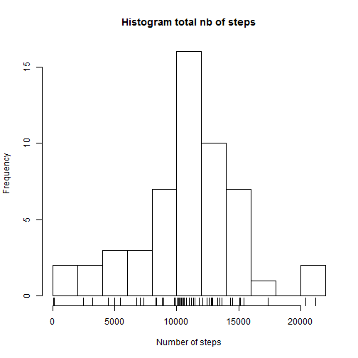
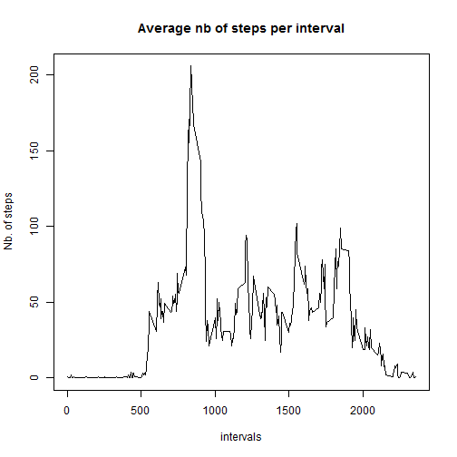

# Reproducible Research Assignment
Author: Leona M.


## Loading and preprocessing the data
We load the data from csv file into a variable and display the structure and summary of the data.

```r
raw_data_actv <- read.csv("activity.csv")
str(raw_data_actv)
```

```
## 'data.frame':	17568 obs. of  3 variables:
##  $ steps   : int  NA NA NA NA NA NA NA NA NA NA ...
##  $ date    : Factor w/ 61 levels "2012-10-01","2012-10-02",..: 1 1 1 1 1 1 1 1 1 1 ...
##  $ interval: int  0 5 10 15 20 25 30 35 40 45 ...
```

```r
summary(raw_data_actv)
```

```
##      steps                date          interval     
##  Min.   :  0.00   2012-10-01:  288   Min.   :   0.0  
##  1st Qu.:  0.00   2012-10-02:  288   1st Qu.: 588.8  
##  Median :  0.00   2012-10-03:  288   Median :1177.5  
##  Mean   : 37.38   2012-10-04:  288   Mean   :1177.5  
##  3rd Qu.: 12.00   2012-10-05:  288   3rd Qu.:1766.2  
##  Max.   :806.00   2012-10-06:  288   Max.   :2355.0  
##  NA's   :2304     (Other)   :15840
```
There are 2304 records with NA values. Date column is not in a date format and needs to be converted. 
Let's clean and convert the data and see again its structure and summary.

```r
data_actv <- raw_data_actv
data_actv$date <- as.Date(data_actv$date)
data_actv <- data_actv[!is.na(data_actv$steps),]
str(data_actv)
```

```
## 'data.frame':	15264 obs. of  3 variables:
##  $ steps   : int  0 0 0 0 0 0 0 0 0 0 ...
##  $ date    : Date, format: "2012-10-02" "2012-10-02" ...
##  $ interval: int  0 5 10 15 20 25 30 35 40 45 ...
```

```r
summary(data_actv)
```

```
##      steps             date               interval     
##  Min.   :  0.00   Min.   :2012-10-02   Min.   :   0.0  
##  1st Qu.:  0.00   1st Qu.:2012-10-16   1st Qu.: 588.8  
##  Median :  0.00   Median :2012-10-29   Median :1177.5  
##  Mean   : 37.38   Mean   :2012-10-30   Mean   :1177.5  
##  3rd Qu.: 12.00   3rd Qu.:2012-11-16   3rd Qu.:1766.2  
##  Max.   :806.00   Max.   :2012-11-29   Max.   :2355.0
```
Now we have 15264 observations after removing the 2304 NA values and we have converted the date.  

## Average total number of steps taken per day  

Let's draw an histogram of the total number of steps per day to see the distribution.   



The mean is : 10766 and the median is : 10765.  
## What is the average daily activity pattern?  
Let's draw times series plot that shows for each interval, the average number of steps done accross the days.  


The interval with the maximum number of steps average is : 835 with an average number of steps of 206.  
## Imputing missing values  
Let's run again the summary on the original/non processed data set to get the total number of missing values. We have 17568 observations and 2304 NA's. 

```
## 'data.frame':	17568 obs. of  3 variables:
##  $ steps   : int  NA NA NA NA NA NA NA NA NA NA ...
##  $ date    : Factor w/ 61 levels "2012-10-01","2012-10-02",..: 1 1 1 1 1 1 1 1 1 1 ...
##  $ interval: int  0 5 10 15 20 25 30 35 40 45 ...
```

```
##      steps                date          interval     
##  Min.   :  0.00   2012-10-01:  288   Min.   :   0.0  
##  1st Qu.:  0.00   2012-10-02:  288   1st Qu.: 588.8  
##  Median :  0.00   2012-10-03:  288   Median :1177.5  
##  Mean   : 37.38   2012-10-04:  288   Mean   :1177.5  
##  3rd Qu.: 12.00   2012-10-05:  288   3rd Qu.:1766.2  
##  Max.   :806.00   2012-10-06:  288   Max.   :2355.0  
##  NA's   :2304     (Other)   :15840
```
Let's create a new dataset where we replace each NA with the average for the interval that we computed before.  
Below is displayed the new dataset structure and summary.  
We still have the same 17568 observations but no more NA's. Also the dates are now converted.  

```r
data_actv_na <- raw_data_actv
na_rows <- is.na(raw_data_actv)
na_intv <- as.character(data_actv_na[na_rows,]$interval)
na_intv_repl <- as.integer(avgsteps[na_intv])
data_actv_na[na_rows,]$steps <- na_intv_repl
data_actv_na$date <- as.Date(data_actv_na$date)

str(data_actv_na)
```

```
## 'data.frame':	17568 obs. of  3 variables:
##  $ steps   : int  1 0 0 0 0 2 0 0 0 1 ...
##  $ date    : Date, format: "2012-10-01" "2012-10-01" ...
##  $ interval: int  0 5 10 15 20 25 30 35 40 45 ...
```

```r
summary(data_actv_na)
```

```
##      steps             date               interval     
##  Min.   :  0.00   Min.   :2012-10-01   Min.   :   0.0  
##  1st Qu.:  0.00   1st Qu.:2012-10-16   1st Qu.: 588.8  
##  Median :  0.00   Median :2012-10-31   Median :1177.5  
##  Mean   : 37.33   Mean   :2012-10-31   Mean   :1177.5  
##  3rd Qu.: 27.00   3rd Qu.:2012-11-15   3rd Qu.:1766.2  
##  Max.   :806.00   Max.   :2012-11-30   Max.   :2355.0
```
Let's draw a histogram of the total number of steps taken each day. 


Now the mean is : 10749 and the median is : 10641.  
In the dataset without NA's, we had : mean = 10766 and median = 10765.  
We can see that the values are now different. The impact of imputing missing values with the average for that interval lowered the mean and median.  

## Differences in activity patterns between weekdays and weekends
Let's add a new variable weekday with 2 factors: weekend / weekday.  
Then we draw the time series plot with 2 panels: one for weekday and another for weekend.  

  
We can see a difference in the activity during Weekday vs. Weekends.  
Activity tends to start earlier during weekdays and later during weekends.  
Activity finishes earlier during weekdays and later during weekends.
During weekdays, there is a pic of activity between interval 750 and 1000. The rest of the time, the activity is  not very high.  
During weekends, there are several pics of activity from interval 750 to interval 2000. 

